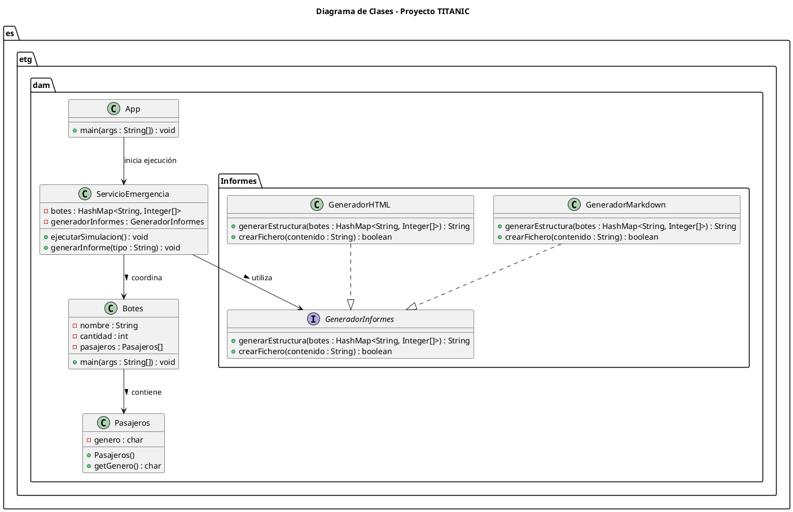

# Proyecto Titanic

## Nombre

- David Oliva Huélamo

---

## Índice

- [Proyecto Titanic](#proyecto-titanic)
  - [Nombre](#nombre)
  - [Índice](#índice)
  - [Análisis del problema](#análisis-del-problema)
  - [Diseño de la solución](#diseño-de-la-solución)
    - [Arquitectura](#arquitectura)
    - [Componentes](#componentes)
      - [`App.java`](#appjava)
      - [`ServicioEmergencias.java`](#servicioemergenciasjava)
      - [`Botes.java`](#botesjava)
      - [`GeneradorMarkdown.java`](#generadormarkdownjava)
    - [Diseño UML](#diseño-uml)
  - [Elementos destacables](#elementos-destacables)
  - [Problemas encontrados](#problemas-encontrados)
  - [Manual de usuario](#manual-de-usuario)
  - [Clonar el repositorio](#clonar-el-repositorio)

---

## Análisis del problema

El proyecto **Titanic** simula un servicio de emergencias encargado de gestionar la evacuación de pasajeros mediante **20 botes salvavidas** numerados de **B00 a B19**.

Cada bote:

- Funciona como un **proceso independiente**.
- Genera un número aleatorio de pasajeros (1–100).  
- Espera entre **2 y 6 segundos** antes de informar su recuento.  
- Devuelve los datos al **Servicio de Emergencias**, que centraliza la información.  

El **Servicio de Emergencias**:

- Coordina la ejecución concurrente de los botes.  
- Espera a que todos terminen.  
- Genera un informe en formato **Markdown (`Informe.md`)**, con el detalle por bote y el total general (hombres, mujeres y niños).  

---

## Diseño de la solución

### Arquitectura

TITANIC/
├── src/
│   ├── main/
│   │   ├── java/
│   │   │   └── es/
│   │   │       └── etg/
│   │   │           └── dam/
│   │   │               ├── App.java
│   │   │               ├── Botes.java
│   │   │               ├── Pasajeros.java
│   │   │               ├── ServicioEmergencia.java
│   │   │               └── Informes/
│   │   │                   ├── GeneradorInformes.java
│   │   │                   ├── GeneradorMarkdown.java
│   │   │                   └── GeneradorHTML.java
│   │   └── resources/
│   │       └── Informe.md
│   └── test
├── .gitignore
├── pom.xml
└── README.md

---

### Componentes

#### `App.java`

Clase principal que inicia la ejecución del programa.  
Su función es invocar a la clase `ServicioEmergencias` para comenzar la simulación completa.

#### `ServicioEmergencias.java`

Coordina la ejecución de los botes salvavidas.

- Lanza los 20 procesos (`java -cp target/classes es.etg.dam.titanic.Botes BXX`).
- Espera a que todos finalicen.  
- Recoge la salida de cada proceso.  
- Calcula los totales globales y genera el informe final en Markdown.

#### `Botes.java`

Simula el comportamiento individual de un bote:

- Recibe como argumento su nombre (`B00`, `B01`, ...).
- Genera un número aleatorio de pasajeros.
- Cada pasajero tiene un género (H, M o N).
- Tras un retardo aleatorio (2–6 segundos), imprime su resultado en formato:

BXXHMNHMMN...

#### `GeneradorMarkdown.java`

Crea el archivo `Informe.md` con la información recopilada.  
Su formato sigue la estructura:

SERVICIO DE EMERGENCIAS
Ejecución realizada el día DD/MM/AAAA a las HH:MM:SS

Bote B00
Total de salvados: XX
-- Hombre: XX
-- Mujer: XX
-- Niño: XX
...

Total General
-- Hombre: XXX
-- Mujer: XXX
-- Niño: XXX

---

### Diseño UML

## Elementos destacables

- Uso de procesos independientes **(Runtime.getRuntime().exec())** para simular cada bote de forma autónoma.

- Simulación de tiempos aleatorios entre 2 y 6 segundos mediante **Thread.sleep()**.

- Generación automática del informe final en formato Markdown, con el detalle por bote y el total general.
  
- Posibilidad de ampliar el sistema fácilmente para soportar otros formatos de informe (HTML, PDF, etc.).

## Problemas encontrados

- Dificultad inicial al coordinar la comunicación entre los procesos y el servicio de emergencias.

- Problemas con la extensión de PlantUML en VS Code al intentar visualizar diagramas directamente en el README.

- La generación del archivo Informe.md requirió afinar el formato de salida para que los totales coincidieran correctamente.

- No se han implementado los tests unitarios

## Manual de usuario

- Java 17 o superior instalado.
- Apache Maven configurado correctamente.
- Clonar el repositorio del proyecto.
- Ejecutar el programa desde la clase App.java.
- Se creará el archivo Informe.md en la carpeta resources del proyecto.
- Abrir Informe.md para ver los resultados.

## Clonar el repositorio

git clone https://github.com/daavidolivaa/titanic